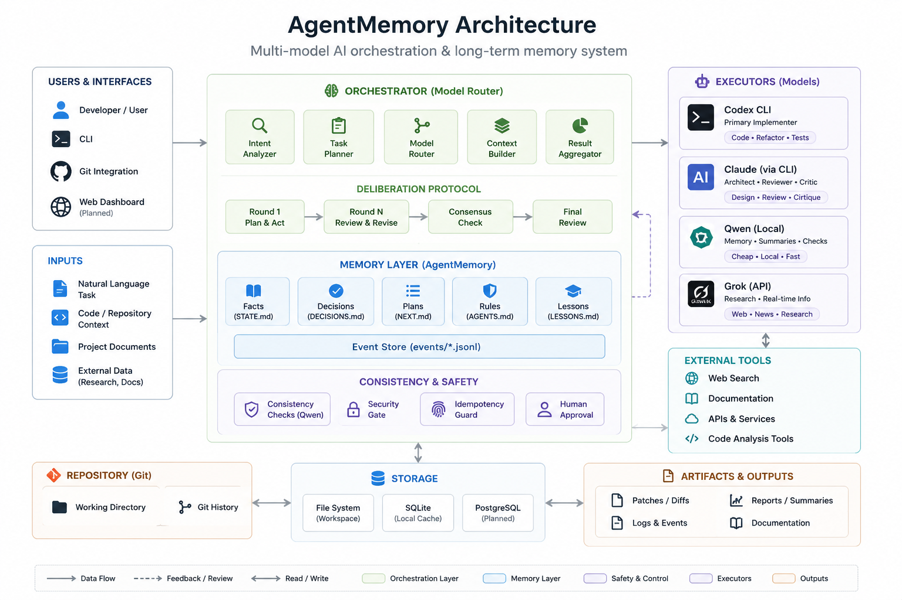

# 🧠 AgentMemory
<p>
  
  
  
  
  
  
</p>
### Multi-model AI orchestration & long-term memory system

AgentMemory — локально управляемая система для совместной работы нескольких AI-моделей над реальными программными проектами.

Система объединяет долговременную память, маршрутизацию задач между моделями, контроль контекста, независимую проверку решений и безопасный процесс внесения изменений в Git-репозитории.

> Этот репозиторий является публичной демонстрацией архитектуры AgentMemory.  
> Основной исходный код, рабочая память проектов, конфигурация и чувствительные данные остаются приватными.

## 🏗 Архитектура

<p align="center">
  
</p>

---

## 🚀 Что умеет AgentMemory

- 🧠 хранить долговременную память проектов;
- 🤖 координировать несколько AI-моделей;
- 🧭 выбирать подходящего исполнителя под тип задачи;
- 🔄 передавать контекст между AI-агентами;
- 🧪 проводить независимую проверку решений;
- 🔐 фильтровать чувствительные данные и секреты;
- 🌳 изолировать изменения через Git worktrees;
- ✅ проверять изменения перед merge;
- 👤 оставлять критические действия под контролем человека;
- 🛠 работать с реальными программными репозиториями.

---

## 🤖 Используемые AI-модели

| Модель | Основная роль |
|---|---|
| Codex | Реализация, работа с кодом и репозиториями |
| Claude | Архитектурный анализ и независимая критика |
| Qwen | Локальный анализ, классификация и дополнительные проверки |
| Grok | Исследование и независимый внешний анализ |

AgentMemory не рассматривает одну модель как универсального исполнителя.

Разные модели получают разные роли, а результаты могут дополнительно проверяться другими участниками системы.

---

## 🏗 Архитектура

```text
                         👤 Human
                            │
                            ▼
                    ┌───────────────┐
                    │  AgentMemory  │
                    │ Orchestrator  │
                    └───────┬───────┘
                            │
              ┌─────────────┼─────────────┐
              │             │             │
              ▼             ▼             ▼
         ┌─────────┐   ┌─────────┐   ┌─────────┐
         │  Codex  │   │ Claude  │   │  Qwen   │
         └─────────┘   └─────────┘   └─────────┘
              │             │             │
              └─────────────┼─────────────┘
                            │
                            ▼
                     ┌─────────────┐
                     │ Verification│
                     │ & Git Gates │
                     └──────┬──────┘
                            │
                            ▼
                     📦 Repository
🧠 Долговременная память

В основе AgentMemory лежит человекочитаемая проектная память.

Ключевые документы хранят:

текущие состояния проектов;
принятые архитектурные решения;
следующие задачи;
правила работы AI-агентов;
накопленные технические уроки;
историю важных изменений.

Markdown используется как человекочитаемый источник истины, а машинные индексы строятся поверх него.

🧭 Model Router

AgentMemory содержит собственный слой маршрутизации задач.

Он определяет:

тип задачи;
требуемую роль;
подходящего AI-исполнителя;
доступность исполнителя;
правила передачи контекста;
необходимость дополнительной проверки.

Пример:

IMPLEMENTER  → Codex
ARCHITECT    → Claude
CRITIC       → Claude
LOCAL WORKER → Qwen
RESEARCH     → внешний research-маршрут
🔐 Security & Privacy

Безопасность рассматривается как отдельная часть архитектуры, а не как дополнение после разработки.

В систему входят механизмы:

ограничения передаваемого AI контекста;
обнаружения потенциальных секретов;
блокировки чувствительных файлов;
контроля дочерних процессов;
изоляции рабочих Git-веток;
проверки состояния репозитория;
независимого review;
fail-closed поведения при неполной проверке;
подтверждения критических операций человеком.

Рабочие API-ключи, токены, .env, пользовательские данные и приватная память проектов в этот Showcase не публикуются.

🌳 Git Change Gate

Изменения могут проходить отдельный контрольный процесс перед попаданием в основную ветку.

Упрощённо:

Task
  ↓
Isolated Worktree
  ↓
Implementation
  ↓
Tests
  ↓
Independent Review
  ↓
Change Gate
  ↓
Human Approval
  ↓
Merge

Цель механизма — не позволять AI самостоятельно считать собственную работу достаточно проверенной.

🧪 Testing

AgentMemory развивается с большим набором автоматизированных тестов.

Проверяются в том числе:

маршрутизация моделей;
обработка контекста;
безопасность;
работа Git-механизмов;
восстановление после ошибок;
валидация результатов моделей;
ограничения и fail-closed сценарии;
orchestration workflows.

На текущих этапах разработки тестовый набор превышает 1000 автоматизированных проверок.

🛠 Технологии

Основные технологии проекта:

Python
SQLite / FTS5
Git
WSL / Linux
Docker
Markdown / Obsidian
MCP
Codex CLI
Claude Code CLI
Local Qwen
Grok API
pytest
🎯 Зачем создан проект

Современные AI-инструменты хорошо решают отдельные задачи, но при длительной разработке возникают проблемы:

модели теряют контекст;
разные AI не имеют общей памяти;
решения одной модели редко независимо проверяются другой;
становится сложно контролировать изменения в больших проектах;
AI может считать работу завершённой раньше, чем она действительно готова.

AgentMemory исследует архитектуру, в которой несколько специализированных AI работают как управляемая команда с общей памятью, проверками и человеческим контролем.

📌 Статус

Active development

AgentMemory используется и развивается на реальных программных проектах.

Этот Showcase будет постепенно пополняться:

архитектурными диаграммами;
примерами workflow;
результатами тестирования;
демонстрациями multi-model взаимодействия;
документацией по основным подсистемам.
👤 Автор

Илья Артамонов

Junior QA Engineer • Technical Support • AI Automation

📍 Astana, Kazakhstan
📧 korresdit@gmail.com
💬 Telegram: @Its_ilyawork

⚠️ Showcase notice

This repository contains documentation and demonstration materials only.

Production configuration, project memory, credentials, API keys, private prompts and the primary AgentMemory source repository are intentionally not published.
